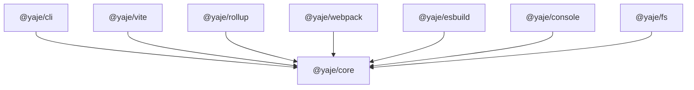

# YAJE - Yeet Another JavaScript Engine / Environment

YAJE (pronounced /dʒɑːdʒi/) is a modern, lightweight JavaScript environment built on top of the **QuickJS-NG** engine.
It aims to provide a fast, embeddable, and compliant JavaScript runtime for systems where a full-blown Node.js or Deno
environment is too heavy or unnecessary.

The core focus of YAJE is to generate standalone executables for all major platforms (Windows, Linux, macOS) with a
minimal footprint — you only get what you need, ensuring your application remains lightweight and efficient.

### Key Features

- **Core Engine**: Uses [QuickJS-NG](https://github.com/quickjs-ng/quickjs) for a compact and highly compliant
  ECMAScript implementation.
- **ESM First**: Tries to be fully compliant with raw ECMAScript Modules (ESM) JavaScript.
- **Native Integration**: Extend the engine with native C modules and bindings.
- **Bundled Output**: Compiles your JavaScript code and native dependencies into a single, standalone executable.
- **No Node.js Compatibility**: YAJE is NOT a Node.js replacement. It does not support Node.js built-in modules or the
  CommonJS module system and never will.

### Project Structure

YAJE is organized as a monorepo using NPM for package orchestration (see `src/test` for an example of how it's used).



- `@yaje/core`: The heart of the engine, providing the C-level infrastructure and basic JS-Native bridge.
- `@yaje/cli`: The command-line interface for project management, building, and generating compilation databases.
- `@yaje/console`: A native module providing a standard `console` API (log, error, warn, etc.).
- `@yaje/fs`: A native module providing synchronous file system operations.
- `@yaje/vite`: Integration for using Vite as a bundler for YAJE applications.
- `@yaje/rollup`: Integration for using Rollup as a bundler for YAJE applications.
- `@yaje/webpack`: Integration for using Webpack as a bundler for YAJE applications.
- `@yaje/esbuild`: Integration for using esbuild as a bundler for YAJE applications.

### Getting Started

#### Prerequisites

- **Clang**: Used for compiling the native engine and your custom modules.
- **Ar**: The standard archiver tool for creating static libraries.
- **Node.js & NPM**: Required for the CLI tool and package management.

#### Installation

Since YAJE is currently in development, you can use it by linking the packages or using the CLI directly from the
source.

#### Creating a New Project

You can initialize a new YAJE project using the CLI:

```bash
yaje init
```

The CLI will prompt you to choose between an **Application** (a standard JS app) or an **Engine Module** (a native C
module extension).

#### Building

To build your project into a standalone executable:

```bash
yaje build
```

This will trace your dependencies, compile any native modules, bundle your JavaScript, and link everything into an
executable in the `.yaje` folder.

#### IDE Support (C/C++)

For better IDE support (like clangd) when developing native modules, you can generate a `compile_commands.json` file:

```bash
yaje cdb
```

### Why YAJE?

YAJE is designed for developers who need a scriptable environment with a small footprint but still want to use modern
JavaScript features. It's ideal for:

- Embedded systems with limited resources.
- Application scripting engines.
- Standalone CLI tools that require native performance for certain tasks.

### License

YAJE is licensed under the MIT License. QuickJS-NG is licensed under the MIT License.
